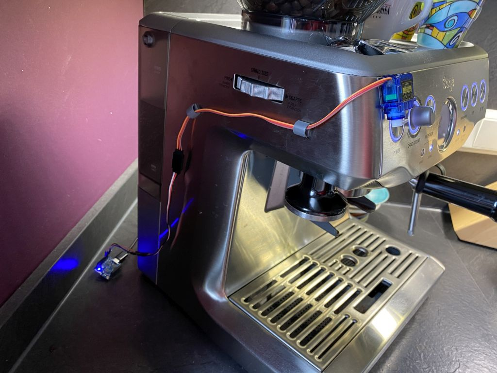

# MrCoffee
The DIY IOT coffee buddy

## Features

- Turn on the machine
- Web UI / interface
- nothing more... 

See demo on YouTube:

## Maybe Future Features (normally they will be never implemented)

 - Time based turn on (this is currently done with an external FHEM who uses the web interface)
 - Light sensor to detect if the machine is already tunred on.
 

